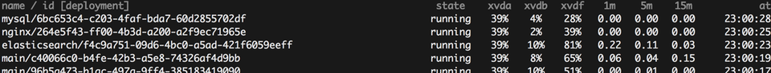

An experiment with [bosh](https://bosh.io) + [nats-go](https://github.com/nats-io/go-nats) + [websockets](https://github.com/gorilla/websocket) + [vue.js](https://vuejs.org/) + [tachyons](http://tachyons.io/).

Connect to bosh director's nats server, subscribing to heartbeat messages, and forwarding them to connected browsers, so a user can see a sortable, live-updating table of VM vitals.

    $ export NATS_URI="$( bosh int bosh.yml --path /instance_groups/0/properties/agent/mbus )"
    $ go run main.go &
    $ open http://localhost:8000/

[MIT License](LICENSE)
